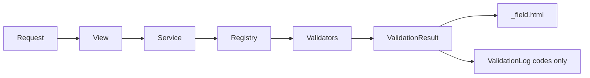

# Form Validation App

A portfolio-style Django 5 showcase for layered form validation with HTMX partials,
custom form fields, validator introspection, formsets, a session-backed wizard, and
focused tests.

## Stack

- Python 3.12 target, Django 5, SQLite for development
- PostgreSQL 16-ready settings through `DATABASE_URL`
- HTMX, optional `django-htmx`, compiled Tailwind CSS (`static/css/forms_lab.css`), Alpine.js
- `phonenumbers`, `python-magic`, Pillow
- Test/lint tools in `requirements-dev.txt` (pytest, pytest-cov, ruff, black, hypothesis, Playwright)

The code includes small fallbacks for optional local dependencies so the app remains
easy to run in constrained demo environments.

```bash
pip install -r requirements.txt          # runtime
pip install -r requirements-dev.txt      # tests, lint, e2e
npm install && npm run build:css         # after changing templates / Tailwind classes
```

## Run

```bash
python -m venv .venv
.venv\Scripts\activate
pip install -r requirements.txt
pip install -r requirements-dev.txt
python manage.py migrate
python manage.py runserver
```

Open http://127.0.0.1:8000/.

## Production

`config/wsgi.py` and `asgi.py` default to `config.settings.prod`, which **requires**
a real `SECRET_KEY` env var (it raises `ImproperlyConfigured` on the dev placeholder).
Static assets are served by WhiteNoise, so collect them after setting the environment:

```bash
export SECRET_KEY=...                        # required by prod settings
export DJANGO_SETTINGS_MODULE=config.settings.prod
python manage.py collectstatic --noinput
python manage.py migrate
```

## Field Partial Contract

`templates/forms/_field.html` is the only place field markup belongs. Every full
form render and every HTMX single-field response uses the same contract:

- `field`: a Django `BoundField`
- `state`: `neutral`, `valid`, or `invalid`
- `message`: optional helper or error text

Adding field HTML elsewhere should be treated as a bug.

## Architecture

A fuller diagram (components, HTMX paths, validation layers) lives in
[docs/architecture.md](docs/architecture.md).



## Demo Forms

- Signup: username/email HTMX checks, password strength, confirmation, PhoneField
- Address: country-dependent state and postal validation
- Payment: Luhn, brand detection, CVV and expiry cross-field rules
- Wizard: session-backed three-step validation and final revalidation
- File upload: magic bytes, file size, image dimensions, multiple files
- Dynamic formset: previous-address rows and duplicate detection
- Survey: mixed widgets and conditional passport validation

## Design Notes

The app intentionally avoids persistence for submitted values. `ValidationLog`
stores only `form_name`, `field_name`, `error_code`, and `created_at`, which powers
the stats page without retaining personal data.

## Limitations and real-world replacements

This project teaches **patterns**, not production integrations. Each demo maps to
typical production choices:

| Demo | What the lab does | Typical production replacement |
|------|-------------------|------------------------------|
| **Signup** | Regex username, static reserved-name blocklist (not live availability), domain *shape* check (not DNS), honeypot + time-trap (`started_at` required on full submit) | Auth provider (e.g. Django auth / OAuth); real username availability API; email verification via SendGrid/Postmark + double opt-in; DNS MX lookup or vendor API (Kickbox, ZeroBounce); [hCaptcha](https://www.hcaptcha.com/) / reCAPTCHA / Turnstile; rate limiting (Redis, CDN/WAF) |
| **Address** | Country-specific regex postal codes | [Google Places](https://developers.google.com/maps/documentation/places/web-service), [Loqate](https://www.loqate.com/), [Smarty](https://www.smarty.com/) for verified addresses |
| **Payment** | Luhn + brand heuristics; masked last4 in memory only | [Stripe Elements](https://stripe.com/payments/elements), Braintree, Adyen — card data never touches your server (PCI SAQ A) |
| **Wizard** | Session JSON for step data | Signed/encrypted session, or persisted draft (`WizardSession` model) with CSRF and step tokens |
| **File upload** | Magic-byte sniff (with fallbacks), size/dimension caps | ClamAV/async malware scan; S3/GCS with pre-signed uploads; separate image pipeline (Imgproxy, Cloudinary) |
| **Formset** | In-memory duplicate street/city/postal check | DB uniqueness constraints, or address normalization service before compare |
| **Survey** | Conditional `clean()` for passport / “other” interest | Same server-side rules, plus client hints; store PII under retention policy if required |

Optional dependency **fallbacks** (`phonenumbers`, `python-magic`) keep the
app runnable in minimal environments; production should install the full stack and
treat fallbacks as dev-only.

## Test and Lint

**Unit** (pytest-django, ~97% coverage on `forms_lab`, `e2e` excluded):

```bash
make test          # or: pytest
make lint
make coverage
```

**E2E** (Playwright — full submit per demo, wizard flow, HTMX blur, page loads):

```bash
pip install -r requirements-dev.txt
python -m playwright install chromium   # once per machine
make test-e2e      # or: pytest -m e2e --no-cov
```

**Full CI parity locally** (migrate, unit, E2E; requires Node for CSS):

```bash
make test-ci
```

On Windows without `make`, run the same commands from the Makefile targets.

GitHub Actions (`.github/workflows/ci.yml`) runs on Postgres: `npm ci` + `build:css`,
`ruff`, unit `pytest`, then `playwright install` + `pytest -m e2e --no-cov`. See
[ADR 0007](docs/adr/0007-single-field-vs-full-form-validation.md) for blur vs full submit.

### HTMX & UI (implemented)

- **Toasts:** `HX-Trigger` JSON events (`fieldValidated`, `cardBrandDetected`) handled in `static/js/forms_lab.js`
- **Spinners:** `#htmx-spinner` via `hx-indicator` on sidebar nav and blur checks
- **Deep links:** sidebar uses `hx-push-url` + `hx-select="#lab-content"`
- **Upload progress:** `<progress id="upload-progress">` driven by `htmx:xhr:progress`
- **Payment CVV:** brand detect sets `maxLength` on `#id_cvv` via `cardBrandDetected` event
- **Accessibility:** `aria-describedby` / `aria-invalid` on inputs; **Esc** clears visible inline error text (demo UX)
- **Signup blur:** wired to `/forms/signup/check-username/` and `check-email/` (reserved-name / email rules demo — not a live availability API)

### Styling

Tailwind is **compiled in-repo** (`npm run build:css` → `static/css/forms_lab.css`).
Commit the built CSS when template classes change. **CI** uses Node 20 (`npm ci` +
`build:css`) before tests so static assets match production-like styling.
