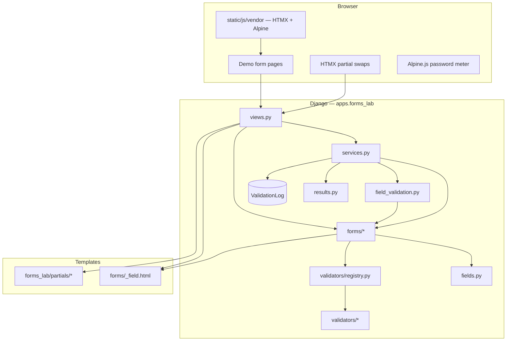
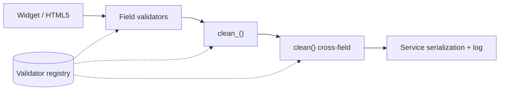

# Architecture

High-level layout of the Form Validation lab. See [README](../README.md) for how to run and test the app.

## System overview

## Request paths

| Path | Handler | Validation |
|------|---------|------------|
| Full POST | `form_detail` → `validate_and_clean()` | Full form / formset / wizard revalidation |
| HTMX field blur | `field_validate` → `validate_single_field()` → `clean_form_field()` | One field (+ `htmx_field_dependencies`); not `clean()` |
| Signup checks | `signup_check_username` / `signup_check_email` | Same as field blur (dedicated URLs) |
| Address country | `address_country_change` | Re-render dependent state/postal partial |
| Payment brand | `payment_brand_detect` | BIN heuristic; `HX-Trigger` for CVV length |
| Wizard step | `wizard_step` | Current step only; step 3 revalidates all session steps |
| Wizard back | GET `form_detail?step=N` + `hx-select="#wizard-shell"` | Loads prior step from session (HTMX, no full reload) |
| File scan | `file_upload_scan` → `validate_file_upload_field()` | **One** field via POST `_field` (not whole form) |
| Formset add | `formset_add_row` | Appends row; 204 when at `max_num` |
| Formset remove | Client `data-formset-remove` + JS reindex | No server endpoint; syncs `TOTAL_FORMS` |
| Survey passport | `survey_toggle_passport` | Swaps `#passport-field` partial |

See [ADR 0007](adr/0007-single-field-vs-full-form-validation.md) for blur vs full submit.

## Field partial

All field markup flows through `templates/forms/_field.html` via
`` or `bound_field_context()` — never a bare
`` with `{field, state, message}` only. Radio/checkbox groups use
`<fieldset>` / `<legend>`; blur HTMX targets `{field_id}-wrap`. Full contract:
[README § Field Partial Contract](../README.md#field-partial-contract).

## Validation layers

Form-level rules (honeypot, time trap, password match, payment expiry/CVV, survey
passport, formset duplicates) run only on **full submit**, not on HTMX blur/scan.

## Front-end assets

| Asset | Build | Served from |
|-------|-------|-------------|
| Tailwind CSS | `npm run build:css` | `static/css/forms_lab.css` |
| HTMX, Alpine | `npm run build:vendor` | `static/js/vendor/*.min.js` |

Run `npm run build` for both. Pinned in `package.json`; copied by
`scripts/copy-vendor-js.mjs`. Same-origin static files (no CDN; no SRI required).

## Data retained

Submitted field values are **not** stored. Only `ValidationLog` rows (`form_name`, `field_name`, `error_code`, `created_at`) are persisted for the stats demo.

## CI and tests

| Layer | Command | CI |
|-------|---------|-----|
| Unit + coverage | `pytest` (default excludes `e2e`; ~177 tests, ~97% on `forms_lab`) | Yes |
| Browser E2E | `pytest -m e2e --no-cov` (~17 tests) | Yes (Chromium, `--with-deps`) |
| Front-end build | `npm run build` (`build:css` + `build:vendor`) | Yes, before tests |
| Lint | `ruff check apps config` | Yes |
| Migrate | `python manage.py migrate --noinput` | Yes |

**Workflow:** `.github/workflows/ci.yml` on Postgres (`config.settings.ci`, `DATABASE_URL`).

Local quick runs use `config.settings.dev` (SQLite) via `pyproject.toml`
(`[tool.pytest.ini_options]`). Parity locally: `make test-ci` with `DATABASE_URL` set
and `DJANGO_SETTINGS_MODULE=config.settings.ci` on migrate/pytest (see Makefile).

Unit tests include HTML id-uniqueness checks for `*-wrap` / `*-message` on every demo
and wizard step.
