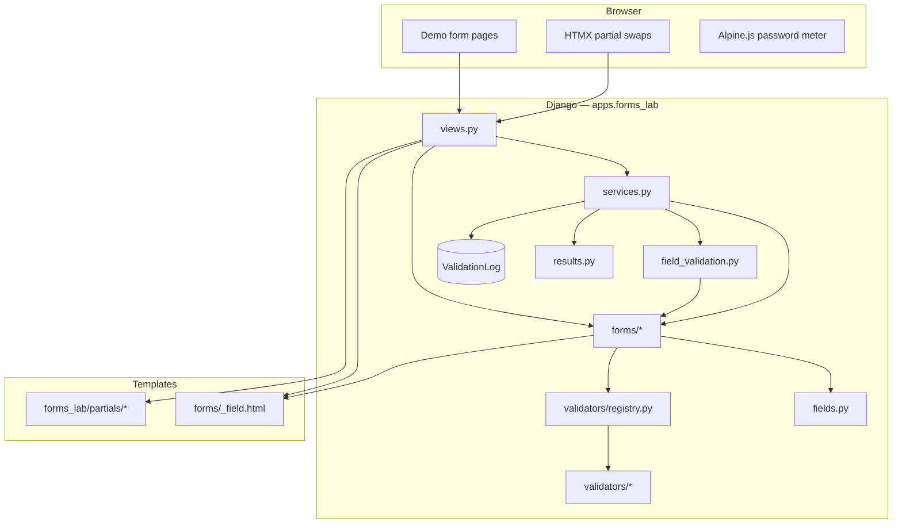
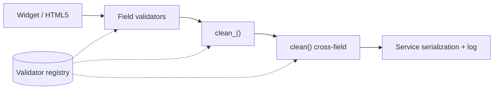

# Architecture

High-level layout of the Form Validation lab. See [README](../README.md) for how to run and test the app.

## System overview

## Request paths

| Path | Purpose |
|------|---------|
| Full POST | `form_detail` → `validate_and_clean()` → entire form / formset |
| HTMX field blur | `field_validate` → `validate_single_field()` → `clean_form_field()` |
| HTMX helpers | Country change, card brand, wizard step, file scan, formset rows |

## Validation layers

## Data retained

Submitted field values are **not** stored. Only `ValidationLog` rows (`form_name`, `field_name`, `error_code`, `created_at`) are persisted for the stats demo.

## CI and tests

| Layer | Command | CI |
|-------|---------|-----|
| Unit + coverage | `pytest` (default excludes `e2e`) | Yes |
| Browser E2E | `pytest -m e2e --no-cov` | Yes (Chromium, `--with-deps` on Linux) |
| CSS build | `npm run build:css` | Yes, before tests |
| Lint | `ruff check apps config` | Yes |

Settings: `config.settings.ci` with Postgres (`DATABASE_URL`). Local quick runs use
`config.settings.dev` (SQLite) via `pyproject.toml` (`[tool.pytest.ini_options]`).
